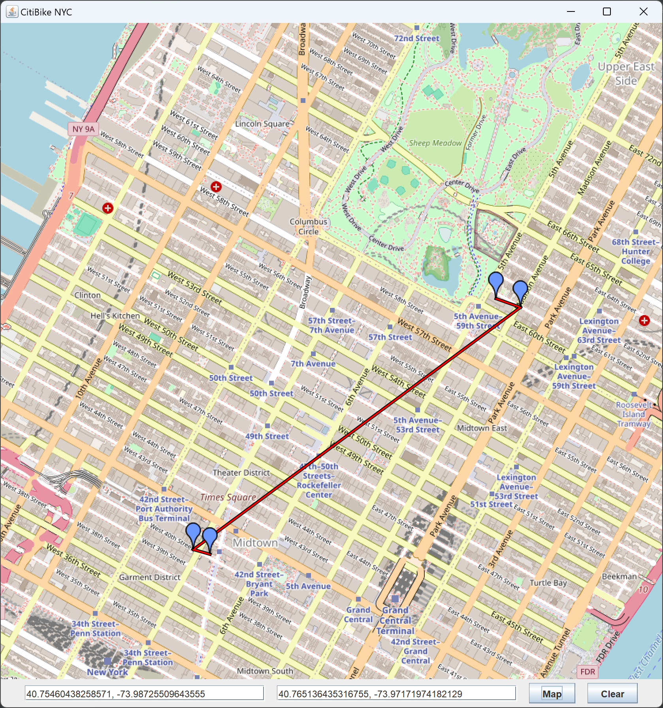

# CitiBike Map Trip Planner

An interactive application that integrates with CitiBike's API to help users find 
the nearest CitiBike stations with available bikes and docks, given their start and destination locations. 
The application also provides a route on a map, connecting the user's selected points with the recommended stations.
[CityBike](https://citibikenyc.com/)

### Links

[JXMapViewer](https://wiki.openstreetmap.org/wiki/JXMapViewer)

[CitiBike Station API Documentation](https://gbfs.citibikenyc.com/gbfs/en/station_information.json)

[CitiBike Status API Documentation](https://gbfs.citibikenyc.com/gbfs/en/station_status.json)

